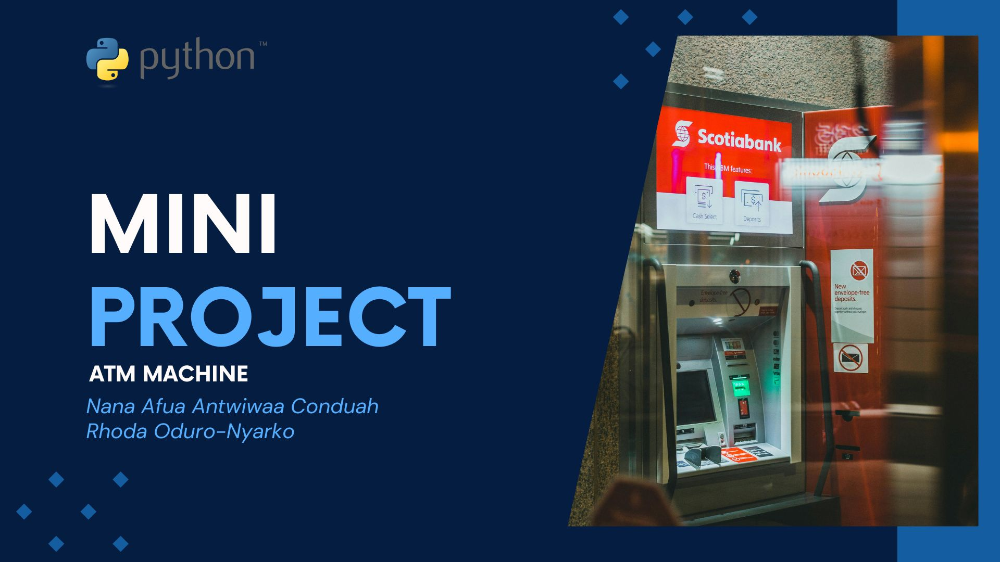

# Mini-Project_ATM-Machine



## Authors
* [Rhoda Oduro-Nyarko](https://github.com/rhoda-lee)
* [Nana Afua Antwiwaa Conduah](https://github.com/Antwi-tech)


## Project Overview
This repository contains a command-line ATM Machine Simulator built with Python, designed to mimic the basic functionality of an ATM. Users can interact with the program to:
1. Check Balance
2. Deposit Funds
3. Withdraw Funds
4. Change PIN

The project is structured to help us understand essential programming 
concepts such as control flow, functions, loops and user authentication.


## How to Use This Repository

```bash
  #Clone the repository to your local machine.
  git clone https://github.com/rhoda-lee/Mini-Project_ATM-Machine.git

  #Navigate to the directory where you cloned it.
  cd Mini-Project_ATM-Machine 

  #Run the provided Python scripts in your terminal.
   python3 control_flow_atm.py

  #Follow the prompts in each script to interact with the programs.
```


## Project Structure
The project contains the following files and directories:

* **control_flow_atm.py**: The main Python script for the ATM Machine simulation, handling user authentication, balance management, deposits, withdrawals, and PIN changes.

Objectives:
* Strengthen control flow through nested conditions.
* Practice variable manipulation, loops, and functions.
* Implement enhanced user security and transaction tracking.

## Features
* User Authentication: 
  - Secure login with PIN verification, allowing only three attempts before blocking access.
* Pin Validation:
  - This ensures that the pin entered is numeric and it a 4-digit number  
* Main Menu:
  - The program provides a clear main menu to check balance, deposit ,withdraw, change pin or exit.  
* Balance Checking: 
  - Displays the user’s current account balance.
* Deposit Funds: 
  - Allows the user to add funds to their balance with input validation.
* Withdraw Funds: 
  - Enables the user to withdraw funds, ensuring sufficient balance.
* Change PIN: 
  - Provides a secure way for users to change their PIN for added security.
* Exit 
  - Users can safely exit the system , with a message to thank them for using Rholant ATM services. 
* Error Handling
  - Checks balance before withdrawal and if deposit amount is positive.  

## Improvements   
* Persistent Account History 
  - This is to enable users return to their user account with a saved history.Example: file based storage and database integration

* Error Handling:
  - Effectively handling non-numeric entry of values that could raise a ValueError    
  

## Tech Stack
* Python


